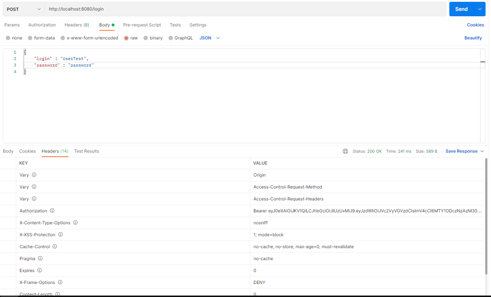
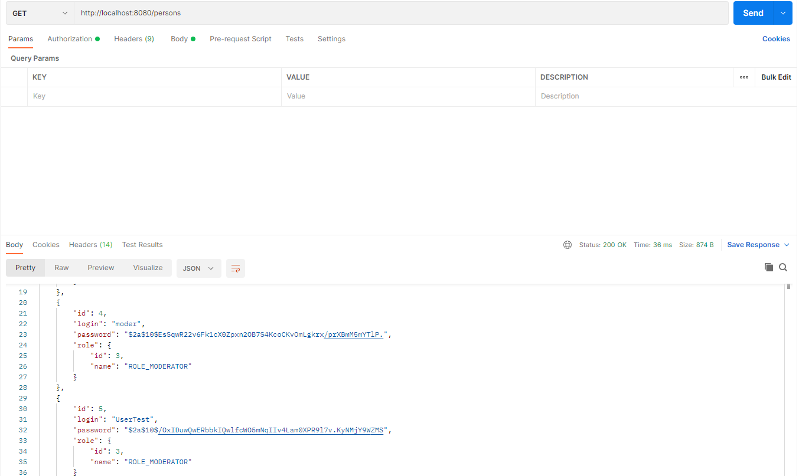
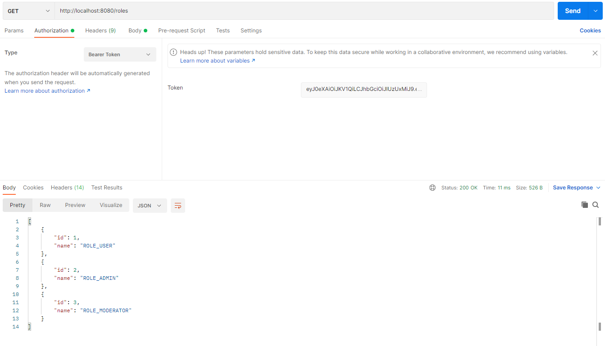
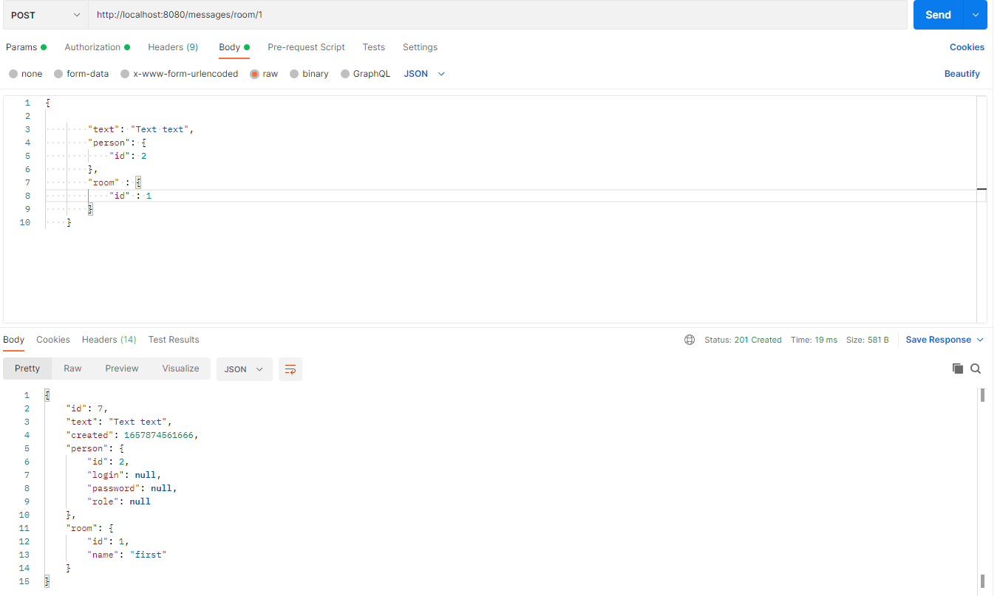
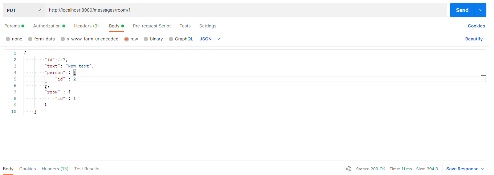
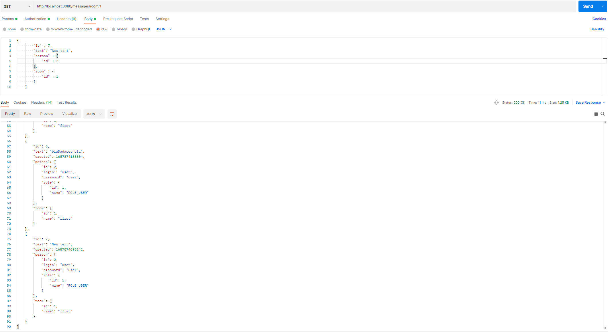

## О проекте.
* Данный проект - Spring boot приложение, представляет собой реализацию чата c комнатами.
* В качестве БД используется PostgreSQL.
* Работа с БД осуществляется через Spring Data JPA.
* Неавторизованные пользователи с приложением работать не могут. Чтобы послать запрос на любой из
  REST-сервисов сначала необходимо пройти авторизацию, в противном случае будет выдана ошибка доступа.
* Авторизация построена на Java JWT. Все зарегистрированные пользователи хранятся в БД.
* Слой контроллеров использует Spring MVC.
* Все контроллеры построены по REST-архитектуре.
* Исключения, выбрасываемые в ходе валидации, обрабатываются в классе, помеченным как @ControllerAdvise.
* Для проверки приложения используется Postman.

## Сборка

Для сборки проекта необходимо:
1. Установить JDK 11.
2. Установить Maven.
3. Установить Postman.
4. Установить сервер БД PostgreSQL, задать логин - *postgres*, пароль - *password*.
5. Скачать исходный код проекта.
6. Создать в pg_Admin БД *chat*.
7. Открыть Query Tool для созданной БД и запустить SQL-скрипт `update_001.sql` из папки `db`.
8. Перейти в корень проекта, где лежит файл `pom.xml`.
9. Собрать проект командой `mvn -DskipTests=true package`.
   При успешной сборке должна появиться папка target c `chat-1.jar`.

#### Технологии
> JDK11, Maven, Spring Boot, Spring Data, PostgreSQL, REST API, JWT-авторизация

## Использование

Запускаем приложение:
```
java -jar chat-1.jar
```

Для отправки HTTP-запросов будем использовать Postman.
При попытке получить доступ без авторизации получим status "403" message "Access Denied".
После авторизации генерируется уникальный токен, который нужно добавить в Headers. 
Токен располагается в заголовке Authorization:

Указываем токен в заголовках отправляемых запросов и получаем доступ ко всем REST-сервисам приложения.
Получение всех пользователей:

Получение всех ролей:

Добавление сообщения с указанием номера комнаты:

Изменение текста сообщения:

Вывод всех сообщений комнаты:



### Контакты:
[][telegram]
[][gmail]
[][linkedin]


[telegram]: https://t.me/GrokDen
[gmail]: mailto:den.voiten@gmail.com
[linkedin]: https://www.linkedin.com/in/denis-voytenko-585488117/

